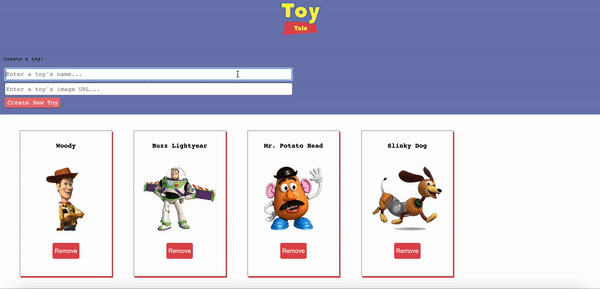
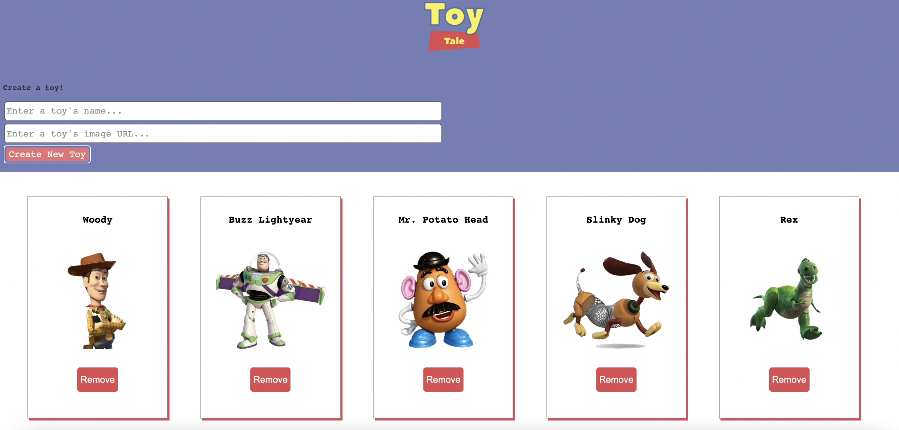
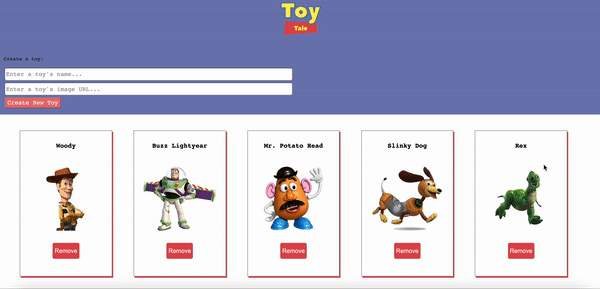
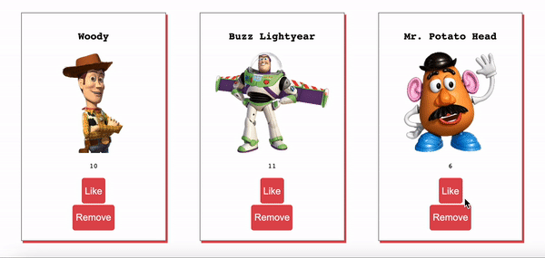

# Fetching to a JSON Server: Mini Project

Up until now, you've mainly been making `GET` requests to APIs. 

Now, you will be using [JSON Server](https://www.npmjs.com/package/json-server) to create a mock REST API that you can make `GET`, `POST`, `DELETE`, `PATCH/PUT` requests to! You will use this mock REST API to build out a front-end web app. 

> In a future unit, you will be building out a real REST API using [Express](https://expressjs.com/)!

## Introduction to Toy Tale

For our project, we are going to build a toy app where a user can manage all their toys. They can view a list of their toys, create new toys, remove toys, and like their toys from the web app. Using the starter code will give you some pre-made styling!



## About JSON Server

JSON Server will allow you to quickly spin up a fake REST API using nothing but a `.json` file. You can read more about [getting started with JSON Server](https://github.com/typicode/json-server#getting-started). 

Examine the `db.json` file. JSON Server is able to set up a fake REST API server using the object inside this JSON file as the "database". 

In our case, our object has a single key named `toys`. As a result, JSON Server will create the following RESTful URL Endpoints:

| HTTP Method | URL Path   | Result                                                     |
| ----------- | ---------- | ---------------------------------------------------------- |
| GET         | /toys      | Responds with all toys                                     |
| GET         | /toys/{id} | Responds with a single toy                                |
| POST        | /toys      | Creates a new toy and responds with the created toy      |
| PUT         | /toys/{id} | Updates an existing toy and responds with the updated toy |
| PATCH       | /toys/{id} | Updates an existing toy and responds with the updated toy |
| DELETE      | /toys/{id} | Removes the toy and responds with an empty object          |


At any point, if you run into any problem, you can reset your mock API by directly editing your `.json` file. 

```json
{
  "toys": [
    {
      "id": 1,
      "name": "Woody",
      "image": "http://www.pngmart.com/files/3/Toy-Story-Woody-PNG-Photos.png",
      "likes": 5
    },
    {
      "id": 2,
      "name": "Buzz Lightyear",
      "image": "http://www.pngmart.com/files/6/Buzz-Lightyear-PNG-Transparent-Picture.png",
      "likes": 3
    },
    {
      "id": 3,
      "name": "Mr. Potato Head",
      "image": "https://vignette.wikia.nocookie.net/universe-of-smash-bros-lawl/images/d/d8/Mr-potato-head-toy-story.gif/revision/latest?cb=20151129131217",
      "likes": 0
    }
  ]
}
```

Make sure your file is properly formatted. You can use a [JSON Validator](https://jsonlint.com/). 

## Install JSON Server

To install JSON Server and be able to use it from your CLI, run `npm install -g json-server` in your terminal. 

> The -g flag indicates that this will be installed as a global node module. You may run into admin permission errors in which case you have two options:
> 1. Try adding `sudo` in front of the install command. This will install the package in "admin mode"
> 2. Remove the `-g` flag and install it locally (you'll see a `node_modules` folder appear in your project)
> 
> At any point, you can view your global node modules with the command: `npm list -g`


### Start your JSON Server

To start your mock API, run `json-server --watch db.json` in your terminal.

Double check that your mock API is up and running by typing `http://localhost:3000/toys` into the browser or POSTMAN. You should see all your toys data in JSON format. Now make a request to `http://localhost:3000/toys/1` and make sure you see a single toy. 

## GET request

When the page loads, we need to make a `GET` fetch and then render all toys on the page.



<details>
<summary>Show Code</summary>

```js
window.addEventListener('DOMContentLoaded', getToys);

async function getToys(){
  const response = await fetch('http://localhost:3000/toys');
  const json = await response.json();
  json.forEach(toy => appendToy(toy));
}

function appendToy(toy){
  let collection = document.querySelector("#collection");
  let div = document.createElement('div');
  let header = document.createElement('h2');
  let image = document.createElement('img');
  let likes = document.createElement('p');
  let likesButton = document.createElement('button');
  let removeButton = document.createElement('button');
  div.className = "card";
  div.id = `card-${toy.id}`; //This step is important for future features
  header.innerText = toy.name;
  image.src = toy.image;
  image.className = "avatar"
  image.alt = toy.name
  likes.innerText = `Likes: ${toy.likes}`;
  likesButton.innerText = "Like"
  removeButton.innerText = "Remove"
  div.append(header, image, likes, likesButton, removeButton);
  collection.append(div);
}
```
</details>

## POST request

Add a feature where the user can create a toy by filling out and submitting the form. Submitting the form should make a `POST` request to your API and add a new toy to the DOM **without** having to refresh the page. For POST, PUT, and PATCH requests, you need to send a `JSON.stringify()` `body` and a `headers` object of `{"Content-Type": "application/json"}` in your `fetch` call.

```js
const options = {
  method: "POST",
  headers: {
    "Content-type": "application/json" 
  },
  body: JSON.stringify({
    key1: 'value1',
    key2: 'value2'
  })
}
fetch(URL, options)
```

Try adding some of the following toy story characters:

| Name | Image URL   | 
| ----------- | ---------- |
| Slinky Dog  | https://www.freeiconspng.com/uploads/slinky-png-transparent-1.png      |
| Rex         | http://umich.edu/~chemh215/W11HTML/SSG5/ssg5.2/FRex.png |
| Bo Peep        | http://4.bp.blogspot.com/_OZHbJ8c71OM/Sog43CMFX2I/AAAAAAAADEs/0AKX0XslD4g/s400/bo.png |
| Hamm         | https://cdn140.picsart.com/244090226021212.png?r1024x1024 |
| Little Green Men | http://www.pngmart.com/files/3/Toy-Story-Alien-PNG-File.png |

> Note: If your webpage is refreshing unexpectedly upon submitting the form, even when you have `e.preventDefault()`, it's likely due to using Live Server. When using JSON Server and Live Server together, making a POST request will update the `.json` file, causing Live Server to restart the webpage. Instead of using Live Server, open the `index.html` file directly in the browser.


<details>
<summary>Show Code</summary>

```js
document.querySelector(".add-form").addEventListener('submit', handleSubmit)

function handleSubmit(e){
  e.preventDefault()
  postToy(e.target[0].value, e.target[1].value)
  e.target.reset()
}

async function postToy(name, image){
  options = {
    method: "POST",
    headers: {
      "Content-type": "application/json"
    },
    body: JSON.stringify({
      name: name,
      image: image,
      likes: 0
    })
  }
  const response = await fetch('http://localhost:3000/toys', options);
  const newToy = await response.json();
  appendToy(newToy)
}
```

</details>

To double check that your `POST` request is sucessful, when you refresh your web app, any newly created toy should still be there! 

> Pro-tip: If you create too much "bad" data, you can open your `.json` file and manually remove the items from the array. That will give you a clean start when you need one. Just be sure it's always valid JSON and you don't have an extra comma or are missing a character. 

## DELETE Request

Add a feature where the user can remove a toy. The removed toy should be deleted from the API and removed from the DOM **without** having to refresh the page. To make sure the feature works correctly, click on "Remove" button which will remove it from the DOM. If you refresh your web app, that will make a fresh `GET` fetch and display all the data. Your deleted toy should not be there!



<details>
<sumary>Show Code</summary>

```js
function appendToy(toy){
  removeButton.addEventListener('click', () => handleRemoveToy(toy.id)); //New line of code
}

async function handleRemoveToy(id){
  options = {
    method: "DELETE"
  }
  fetch(`http://localhost:3000/toys/${id}`, options);
  document.querySelector(`#card-${id}`).remove(); //Optimistic Rendering
}
```
</details>

## PATCH Request

Add a feature where the user can update a toy's like count by clicking on its "Like" button **without a page refresh**. In addition, you should be able to build out this feature wihtout making an additional `GET` request. 

In the demo below, when a user click's on a toy's "Like" button, it makes a `PATCH` request to increment that toy's `likes` by 1. This change should persist. In other words, a refresh of the page will show the like count has been _saved_ to the JSON Server. For POST, PUT, and PATCH requests, you need to send a `JSON.stringify()` `body` and a `headers` object of `{"Content-Type": "application/json"}` in your fetch.



<details>
<summary>Show Code</summary>

```js
function appendToy(toy){
  likes.id = `likes-${toy.id}`; //New line of code
  likesButton.addEventListener('click', () => {handleLikeToy(toy.id)}); //New line of code
}

async function handleLikeToy(id){
  let likesParagraph = document.getElementById(`likes-${id}`)
  let likeCount = Number(likesParagraph.innerText.split(" ")[1])
  options = {
    method: "PATCH",
    headers: {
      "Content-type": "application/json"
    },
    body: JSON.stringify({
      likes: likeCount + 1
    })
  }
  fetch(`http://localhost:3000/toys/${id}`, options)
    .then(res => res.json())
    .then(data => {
      likesParagraph.innerText = `Likes: ${likeCount + 1}`; //Pessimistic Rendering
    })
}
```
</details>
